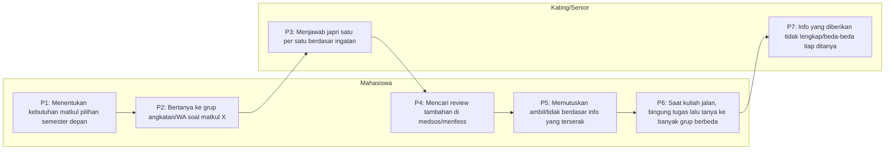

⚠️ ARSIP — digantikan oleh Planning-Milestone1-KuliahBareng-ITB-v2.md. Jangan dipakai sebagai acuan kerja.

# Planning Milestone 1 — IF3151 Interaksi Manusia Komputer
## Ide: "KuliahBareng" — Info Matkul & Dosen, Forum Tanya Teman, Kalkulator IPK, & Simulasi Rencana Studi untuk Mahasiswa ITB
### (Adaptasi ringkas dari TemanKuliah — RISTEK Fasilkom UI)

> Dokumen ini adalah kerangka kerja lengkap dari riset sampai draft PPT Milestone 1.
> Isinya masih **contoh/skeleton** — ganti bagian yang bertanda `[...]` dengan data asli kelompok kalian setelah wawancara.

---

## 0. Ringkasan Ide Proyek

**Referensi:** TemanKuliah (RISTEK Fasilkom UI) — aplikasi all-in-one untuk mahasiswa UI dengan 3 fitur utama: Kalkulator Nilai, Course Review (ulasan matkul & dosen), dan Tanya Teman (forum tanya-jawab akademik).

**Adaptasi untuk ITB — dipakai 4 fitur inti** (biar scope Milestone 1 tetap realistis untuk tugas HCI satu semester, tapi tidak sesempit versi awal):

| Fitur | Diambil? | Alasan |
|---|---|---|
| **Ulasan Matkul & Dosen** | ✅ Dipakai | Ini akar masalah utama: info soal matkul/dosen ITB tersebar & tidak terverifikasi |
| **Tanya Teman (forum Q&A akademik per matkul)** | ✅ Dipakai | Melengkapi fitur 1 — begitu user tahu matkulnya, dia butuh tempat bertanya yang relevan |
| **Kalkulator IPK** | ✅ Dipakai | Masalah nyata & sering dikerjakan manual pakai Excel/kalkulator HP sendiri; ringan diimplementasikan sebagai prototipe & langsung related ke perencanaan matkul |
| **Simulasi Rencana Pengambilan Matkul sampai Lulus S1** | ✅ Dipakai | Melengkapi kalkulator IPK — mahasiswa bisa coba-coba susun matkul per semester ke depan dan cek apakah rencananya realistis untuk lulus tepat waktu |
| Testimoni matkul per-individu (bukan agregat ulasan/rating) | ❌ Drop | Terlalu granular untuk scope Milestone 1 — cukup ditangani lewat ulasan & rating agregat di fitur "Ulasan Matkul & Dosen", bisa jadi fitur v2 |
| Integrasi SIX/susun jadwal otomatis (real-time API) | ❌ Drop | Butuh akses API sistem akademik ITB (SIX ITB) yang tidak feasible untuk prototipe kuliah — simulasi rencana matkul di atas tetap jalan manual/berbasis input user, bukan integrasi otomatis |

> ⚠️ **Silakan sesuaikan** nama produk, cakupan fitur, dan SDG di atas dengan hasil diskusi kelompok kalian dan pilihan SDG resmi di `s.hmif.dev/KelompokIMK` (satu kelas tidak boleh ada SDG yang sama).

---

## 1. Deskripsi Topik

### 1.a Latar Belakang

Mahasiswa ITB — terutama **mahasiswa TPB yang baru akan memilih prodi/matkul pilihan**, **mahasiswa yang mengambil matkul lintas jurusan (mayor-minor)**, dan **mahasiswa pindahan/exchange** — sangat bergantung pada informasi lisan (cerita kating, grup WhatsApp angkatan, akun menfess Instagram) untuk memutuskan matkul dan dosen yang akan diambil di FRS.

Masalahnya:
- Info **tidak terdokumentasi**, tersebar di puluhan grup WA/Line yang berbeda per angkatan/himpunan
- Info **tidak terverifikasi** — bisa jadi opini 1 orang yang di-generalisasi ("dosen ini killer katanya")
- Pertanyaan soal tugas/materi **diulang-ulang** ke kating yang sama tiap tahun, melelahkan bagi kating dan lambat bagi adik tingkat
- Mahasiswa baru pindah/TPB **tidak tahu harus tanya siapa** karena belum kenal siapa-siapa

Di sisi lain, banyak mahasiswa juga masih **menghitung IPK dan menyusun rencana matkul sampai lulus secara manual** — pakai spreadsheet sendiri, catatan pribadi, atau sekadar kira-kira — karena tidak ada satu tempat yang menggabungkan informasi matkul/dosen dengan alat bantu perencanaan studi.

**Celah UX**: tidak ada satu tempat terpusat, kredibel, dan mudah dicari untuk (1) mengetahui gambaran realistis suatu matkul & dosennya sebelum mengambil, (2) tempat bertanya yang terarah (bukan broadcast ke banyak grup), dan (3) memantau/merencanakan progres akademik (IPK & matkul ke depan) tanpa alat bantu eksternal.

### 1.b Relevansi dengan SDG

**Draf usulan: SDG 4 — Quality Education**, Target **4.3**: *"By 2030, ensure equal access for all women and men to affordable and quality technical, vocational and tertiary education, including university."*

| Aspek | Keterkaitan |
|---|---|
| Akses informasi akademik | Menyamaratakan akses info matkul/dosen — mahasiswa baru/pindahan tidak lagi bergantung pada koneksi sosial (kenal kating atau tidak) |
| Kualitas pengalaman belajar | Mahasiswa bisa memilih matkul yang sesuai gaya belajarnya → mengurangi drop/mengulang matkul |
| Inklusi sosial | Membantu mahasiswa introvert/pendatang yang belum banyak kenalan senior |
| Efisiensi & keberlanjutan sistem akademik | Mengurangi pertanyaan berulang yang membebani kating & dosen wali |

> Cek ulang target/indicator resminya di [sdgs.un.org](https://sdgs.un.org) dan sesuaikan penomoran figure sesuai contoh dari asisten (lihat gambar "Contoh Topik").

### 1.c Pendekatan Riset

- **Metode**: **Wawancara semi-terstruktur (semi-structured interview)** saja — tidak pakai kuesioner.
- **Alasan pilih wawancara murni**: topik ini butuh pemahaman *mendalam* tentang kebiasaan mencari info & pain point personal (cerita "pernah salah ambil matkul karena ...") yang lebih kaya digali lewat obrolan daripada form tertutup.
- **Jumlah & pembagian informan**: kelompok beranggotakan **5 orang**, masing-masing anggota mewawancarai **2 informan**, sehingga total **10 informan**. Kalau bisa, tiap anggota memilih 2 informan dengan **jurusan berbeda dan angkatan berbeda** satu sama lain, supaya insight yang terkumpul lebih beragam dan tidak bias ke satu circle/jurusan saja.
- **Segmen informan** (dibagi rata, tiap segmen idealnya diisi oleh 1 anggota kelompok sebagai PIC wawancara):

| Segmen | Jumlah | Kriteria | PIC Wawancara |
|---|---|---|---|
| Mahasiswa TPB (tingkat 1) | 2 orang | Belum lama pilih prodi/matkul pilihan pertama kali; usahakan beda rencana jurusan | `[PIC-1]` |
| Mahasiswa tingkat 2-3 aktif ambil matkul lintas jurusan (mayor-minor) | 2 orang | Sering ambil matkul di luar prodi sendiri; usahakan beda jurusan asal & angkatan | `[PIC-2]` |
| Kating/senior yang sering ditanyai adik tingkat | 2 orang | Aktif di grup angkatan/himpunan sebagai "tempat bertanya"; usahakan beda jurusan & angkatan | `[PIC-3]` |
| Mahasiswa yang biasa hitung IPK/rencana studi manual | 2 orang | Rutin memantau IPK atau menyusun rencana matkul sendiri (mis. pakai Excel/Sheets/catatan pribadi); usahakan beda jurusan & angkatan | `[PIC-4]` |
| Mahasiswa tingkat akhir yang sedang menyusun sisa matkul sampai lulus S1 | 2 orang | Sedang/baru saja merencanakan matkul sisa untuk lulus tepat waktu, bisa menilai realistis-nya sebuah simulasi rencana studi | `[PIC-5]` |

- **Durasi**: 20-30 menit/sesi, direkam (audio/video) dengan izin narasumber untuk keperluan **Evidence User Gathering**.
- **Lokasi**: bisa tatap muka (kantin, selasar, kos) atau video call.

---

## 2. Panduan Wawancara (Interview Guide)

> Gunakan sebagai kerangka, boleh probing lebih dalam sesuai jawaban narasumber. Rekam & catat kutipan penting untuk dikutip di slide "Masalah/Opportunity" nanti.

### A. Pembukaan (2 menit)
1. Perkenalan singkat pewawancara + tujuan riset ("kami sedang riset UX soal cara mahasiswa ITB cari info matkul/dosen")
2. Minta izin rekam untuk dokumentasi tugas kuliah
3. Data diri informan: nama/inisial, angkatan, prodi/fakultas, semester berapa sekarang

### B. Kebiasaan Akademik Umum
4. Bagaimana biasanya kamu memutuskan mau ambil matkul pilihan/mayor-minor apa tiap semester?
5. Sebelum mengambil suatu matkul, dari mana saja biasanya kamu cari info soal dosennya, cara ngajarnya, atau beban tugasnya?
6. Seberapa sering kamu tanya ke kating/senior soal matkul? Lewat media apa (chat pribadi, grup WA, japri Line, dsb)?
7. Apakah kamu pernah baca ulasan/opini soal matkul atau dosen di media sosial (menfess, akun himpunan, dsb)? Ceritakan pengalamannya.
8. Bagaimana caramu memantau IPK atau merencanakan matkul yang harus diambil sampai lulus S1? (mis. hitung manual, pakai Excel/Sheets sendiri, tanya kating, atau belum kepikiran sama sekali)

### C. Perilaku Bertanya Soal Tugas/Materi
9. Kalau kamu bingung soal tugas atau materi kuliah, biasanya kamu tanya ke siapa dan lewat platform apa?
10. Pernahkah kamu kesulitan mencari lagi jawaban/diskusi yang sebenarnya sudah pernah dibahas di grup WA sebelumnya? Ceritakan kejadiannya.
11. Bagaimana perasaanmu kalau harus bertanya hal yang sama ke banyak grup/orang berbeda untuk dapat jawaban?

### D. Identifikasi Masalah (Pain Points)
12. Ceritakan pengalaman kamu (kalau ada) salah ambil matkul karena kurang informasi di awal — misalnya ternyata dosennya berat, tugasnya banyak banget, dsb. Apa dampaknya?
13. Menurutmu, apa hal paling menyebalkan saat mencari info soal matkul/dosen di ITB?
14. Pernahkah kamu ragu dengan kebenaran info yang kamu dapat dari kating/senior/menfess? Kenapa bisa ragu?
15. *(khusus kating)* Apa yang bikin kamu capek/males saat harus menjawab pertanyaan adik tingkat yang itu-itu lagi tiap tahun?
16. Pernahkah kamu salah hitung IPK atau salah rencana ambil matkul (mis. telat sadar SKS kurang/kelebihan, salah prasyarat) karena rencana studinya cuma dihitung manual/kira-kira? Ceritakan.

### E. Harapan & Ekspektasi terhadap Solusi
17. Kalau ada aplikasi khusus untuk cari info matkul & dosen ITB, fitur apa yang paling kamu butuhkan?
18. Info seperti apa yang bikin kamu percaya sama sebuah ulasan matkul/dosen (misalnya nama verified prodi, jumlah ulasan, foto rekap nilai, dll)?
19. Kalau mau bertanya soal tugas ke sesama mahasiswa, kamu lebih nyaman di forum terbuka (semua bisa lihat) atau chat privat/anonim? Kenapa?
20. Seberapa kepikiran kamu untuk pakai fitur kalkulator IPK otomatis atau simulasi rencana matkul sampai lulus dalam satu aplikasi yang sama dengan ulasan matkul & forum tanya-jawab? Kenapa?
21. Apa yang biasanya bikin kamu males install/pakai aplikasi akademik baru?

### F. Penutup
22. Ada hal lain terkait cara kamu cari info akademik atau rencana studi di ITB yang belum kita bahas tapi menurutmu penting?
23. Terima kasih + konfirmasi ulang izin pakai rekaman/foto sesi ini sebagai lampiran evidence tugas.

### Tips pelaksanaan
- Satu anggota jadi pewawancara, satu jadi pencatat/perekam agar wawancara tidak kaku.
- Simpan hasil transkrip/rangkuman per informan → dipakai sebagai sumber kutipan di slide Masalah & User Persona.
- Screenshot/foto sesi wawancara (dengan wajah/nama disamarkan jika perlu) → untuk lampiran **Evidence User Gathering**.

---

## 3. Masalah & Opportunity (Problem Space)

> Diisi berdasarkan pola yang muncul berulang dari hasil wawancara. Format: M-kode, deskripsi, sumber data pendukung.

- **M1: Informasi kualitas matkul & dosen tidak terpusat dan tidak terverifikasi** → karena mahasiswa hanya mengandalkan cerita lisan dari kating/grup angkatan
  - Contoh temuan: `[X dari Y informan mengaku sumber utama info adalah "tanya kating"]`
- **M2: Mahasiswa baru/TPB kesulitan mendapat gambaran realistis soal beban kerja (workload) suatu matkul sebelum mengisi FRS** → karena belum kenal siapa-siapa yang pernah ambil matkul tersebut
  - Contoh temuan: `[kutipan singkat pengalaman salah ambil matkul]`
- **M3: Pertanyaan seputar tugas/materi kuliah tersebar di banyak grup WA berbeda dan sulit dicari kembali** → karena tidak ada arsip yang searchable
  - Contoh temuan: `[jumlah informan yang pernah kesulitan cari chat lama]`
- **M4 (Opportunity): Kating/senior punya banyak pengalaman & tips matkul yang tidak pernah terdokumentasi** → sayang kalau hilang begitu saja tiap kating lulus
  - Contoh temuan: `[kutipan kating yang capek dtanya berulang]`
- **M5: Mahasiswa menghitung IPK dan merencanakan matkul sampai lulus S1 secara manual, rawan salah hitung/salah rencana** → karena tidak ada alat bantu terintegrasi, biasanya pakai Excel/Sheets/catatan pribadi atau kira-kira saja
  - Contoh temuan: `[jumlah informan yang pernah salah hitung IPK/salah rencana SKS-prasyarat matkul]`

---

## 4. User Goals (dalam bentuk User Story)

Format: **As a [role], I want [goal], so that [reason/value].**

- **UG1**: *As a* mahasiswa yang akan mengisi FRS, *I want* melihat ulasan matkul dan dosen yang kredibel, *so that* saya bisa memilih matkul yang sesuai ekspektasi dan gaya belajar saya. → menjawab **M1, M2**
- **UG2**: *As a* mahasiswa yang sedang bingung mengerjakan tugas, *I want* bertanya ke sesama mahasiswa yang pernah/sedang mengambil matkul yang sama, *so that* saya dapat jawaban yang relevan tanpa harus japri banyak orang. → menjawab **M3, M4**
- **UG3**: *As a* mahasiswa senior yang sudah lulus suatu matkul, *I want* membagikan pengalaman & tips soal matkul tersebut, *so that* adik tingkat tidak mengulang kesalahan yang sama dan saya tidak perlu menjawab pertanyaan yang sama berulang-ulang. → menjawab **M4**
- **UG4**: *As a* mahasiswa pindahan/exchange yang baru di ITB, *I want* melihat gambaran menyeluruh matkul-matkul di suatu prodi, *so that* saya bisa merencanakan studi dengan percaya diri walau belum kenal siapa-siapa. → menjawab **M1, M2**
- **UG5**: *As a* mahasiswa yang ingin memantau performa akademiknya, *I want* menghitung IPK secara otomatis dari nilai yang saya input, *so that* saya tidak perlu hitung manual tiap semester dan bisa langsung lihat proyeksi IPK ke depan. → menjawab **M5**
- **UG6**: *As a* mahasiswa yang merencanakan studi jangka panjang, *I want* mensimulasikan pengambilan matkul per semester sampai lulus S1, *so that* saya tahu apakah rencana studi saya realistis dan memenuhi syarat kelulusan sebelum benar-benar mengisi FRS. → menjawab **M5, M2**

---

## 5. Business Process Flow (Swimlane)

Diagram ini menggambarkan alur **natural/existing** (tanpa aplikasi dulu) — beri kode P1, P2, dst.

**Deskripsi tiap proses:**
- **P1**: Mahasiswa menentukan matkul apa saja yang perlu/ingin diambil semester depan berdasarkan kurikulum.
- **P2**: Mahasiswa bertanya ke grup angkatan/WA/Line soal matkul tertentu.
- **P3**: Kating menjawab satu per satu berdasar ingatan, sering japri terpisah-pisah.
- **P4**: Mahasiswa mencari tambahan info di media sosial (akun menfess, story IG).
- **P5**: Mahasiswa memutuskan ambil/tidak dengan info yang serba tidak lengkap.
- **P6**: Saat kuliah berjalan dan bingung tugas, mahasiswa bertanya ke banyak grup berbeda untuk 1 pertanyaan yang sama.
- **P7**: Kating memberi info tidak konsisten karena capek ditanya berulang, kadang lupa detail.

> **Catatan (M5)**: di luar alur di atas, mahasiswa juga rutin menjalani proses terpisah setiap semester — menghitung IPK dan menyusun rencana matkul sisa sampai lulus secara manual (Excel/Sheets/kira-kira sendiri) — yang rawan salah hitung SKS/prasyarat. Proses ini tidak digambar sebagai swimlane tersendiri karena sifatnya individual (bukan interaksi mahasiswa↔kating), tapi tetap jadi sumber M5 dan dasar UG5/UG6.

---

## 6. Karakteristik User (User Persona)

### Persona 1

**Nama**: Kirana Wijaya — Mahasiswa TPB
**Kategori**: *Anxious First-Year Course Picker*
**Umur**: 18 tahun | **Prodi**: TPB (belum memilih prodi tetap) | **Semester**: 2

**Bio**: Kirana baru lulus SMA dan masuk ITB tahun ini. Ia belum banyak kenal kakak tingkat di luar circle OSKM-nya, dan bingung menentukan matkul pilihan/prodi lanjutan karena semua informasi yang ia dapat berasal dari cerita berbeda-beda antar kating.

**Goals & Needs**: Info matkul dan dosen yang jelas dan bisa dipercaya; ingin tahu ekspektasi beban tugas sebelum mengambil; ingin bertanya tanpa canggung karena belum kenal siapa-siapa; ingin tahu apakah rencana matkul yang ia susun sendiri sudah masuk akal untuk beberapa semester ke depan.

**Tasks**: Mencari ulasan matkul lewat HP; membandingkan beberapa opsi matkul pilihan; bertanya ke forum tanpa harus kenal orangnya duluan; coba-coba simulasi rencana matkul beberapa semester ke depan.

**Pain Points**: Takut salah ambil matkul karena minim informasi; malu bertanya langsung karena masih baru; informasi dari kating sering berbeda-beda dan membingungkan.

### Persona 2

**Nama**: Bagas Pratama — Mahasiswa Tingkat 3
**Kategori**: *Cross-Major Explorer & Reluctant Kating*
**Umur**: 21 tahun | **Prodi**: Teknik Informatika | **Semester**: 6

**Bio**: Bagas aktif ambil matkul pilihan/mayor-minor lintas jurusan sehingga sering masuk kelas dengan dosen dan mahasiswa yang belum ia kenal. Di sisi lain, sebagai mahasiswa tingkat atas ia juga sering ditanyai adik tingkat soal matkul yang pernah ia ambil — pertanyaan yang sama, berulang-ulang, tiap semester.

**Goals & Needs**: Ingin cepat dapat gambaran matkul lintas jurusan yang asing baginya; ingin punya cara membagikan pengalamannya sekali saja tanpa harus menjawab manual berulang kali ke tiap angkatan baru; capek hitung IPK sendiri tiap semester pakai Excel pribadi dan ingin caranya lebih praktis.

**Tasks**: Membaca ulasan matkul di luar jurusannya sebelum daftar; menulis ulasan/tips matkul yang pernah ia ambil; menjawab pertanyaan spesifik di forum bila relevan dengan pengalamannya.

**Pain Points**: Capek dijapri berulang oleh adik tingkat berbeda dengan pertanyaan yang sama; tidak ada tempat terpusat untuk "titip" jawaban yang bisa dibaca banyak orang sekaligus.

---

## 7. Scenario

**Skenario "Semester Baru, Bingung Pilih Lagi"**

Seminggu sebelum masa pengisian FRS dibuka, Kirana duduk di kamar kosnya sambil membuka draf kurikulum TPB miliknya, mencoba **menentukan matkul pilihan yang harus ia ambil (P1)**. Ia belum tahu harus ambil yang mana karena semua terdengar asing baginya.

Malam itu ia membuka grup WhatsApp angkatannya dan **bertanya soal salah satu matkul incaran (P2)**. Beberapa menit kemudian, dua kating membalas dengan jawaban yang saling bertentangan — satu bilang dosennya santai, satu lagi bilang tugasnya menumpuk **(P3)**. Merasa belum yakin, Kirana **mencari tambahan info di akun menfess ITB (P4)**, menemukan beberapa post lama soal dosen yang sama namun konteksnya sudah beda tahun ajaran.

Karena waktu FRS makin mepet, Kirana akhirnya **memutuskan mengambil matkul tersebut berdasarkan informasi yang serba tidak lengkap (P5)**. Dua minggu masuk perkuliahan, ia dikagetkan tugas kelompok besar yang jauh dari ekspektasinya. Ia pun **bertanya ke berbagai grup berbeda mencari yang pernah mengerjakan tugas serupa (P6)**, namun jawabannya tersebar dan sulit ditelusuri kembali keesokan harinya.

Di sisi lain, Bagas — salah satu kating yang sempat menjawab Kirana — merasa lelah karena pertanyaan serupa datang lagi dari mahasiswa lain di angkatan berbeda minggu itu juga **(P7)**, padahal ia sudah menjelaskan hal yang sama tahun lalu.

---

## 8. User Tasks

> User Task diturunkan dari tiap User Goal, dikaitkan dengan Proses (P) terkait, dan PIC anggota tim (ganti dengan NIM/nama asli anggota kelompok).

| User Goal | Proses | User Task | PIC |
|---|---|---|---|
| UG1 | P1, P2 | UT1.1 Mencari matkul & dosen berdasar nama/kode matkul | `[PIC-1]` |
| UG1 | P4 | UT1.2 Membaca ulasan & rating matkul/dosen dari mahasiswa lain | `[PIC-1]` |
| UG1 | P5 | UT1.3 Membandingkan beberapa matkul pilihan sekaligus | `[PIC-2]` |
| UG2 | P6 | UT2.1 Mengajukan pertanyaan di forum matkul tertentu | `[PIC-2]` |
| UG2 | P6 | UT2.2 Mencari pertanyaan lama yang relevan sebelum bertanya ulang | `[PIC-3]` |
| UG3 | P7 | UT3.1 Menulis ulasan/tips matkul yang sudah pernah diambil | `[PIC-3]` |
| UG3 | P7 | UT3.2 Menjawab pertanyaan mahasiswa lain di forum | `[PIC-4]` |
| UG4 | P1 | UT4.1 Menjelajah daftar seluruh matkul di suatu prodi | `[PIC-4]` |
| UG5 | M5 | UT5.1 Menghitung IPK otomatis dari input nilai & SKS | `[PIC-5]` |
| UG6 | M5, P1 | UT6.1 Mensimulasikan rencana pengambilan matkul sampai lulus S1 | `[PIC-5]` |

### Deskripsi Detail per User Task

**PIC: `[PIC-1]`**
- **UT1.1 — Mencari matkul & dosen**
  - User/pengguna: Semua mahasiswa
  - Deskripsi: Fitur pencarian matkul berdasarkan nama/kode/dosen pengampu
  - Tipe Interaksi: *Instructing* (mengetik query di search bar)
  - Model/Metafora: Seperti mesin pencari (mis. Google) khusus katalog matkul ITB
- **UT1.2 — Membaca ulasan matkul/dosen**
  - User/pengguna: Semua mahasiswa, terutama TPB & mahasiswa lintas jurusan
  - Deskripsi: Menampilkan kumpulan ulasan & rating dari mahasiswa yang pernah mengambil
  - Tipe Interaksi: *Exploring* (scroll & membaca ulasan)
  - Model/Metafora: Seperti membaca ulasan produk di e-commerce (rating bintang + komentar)

**PIC: `[PIC-2]`**
- **UT1.3 — Membandingkan matkul pilihan**
  - User/pengguna: Mahasiswa yang sedang FRS-an
  - Deskripsi: Menampilkan beberapa matkul berdampingan untuk dibandingkan ringkasan info-nya
  - Tipe Interaksi: *Exploring*
  - Model/Metafora: Seperti membandingkan tab produk pada e-commerce
- **UT2.1 — Mengajukan pertanyaan di forum matkul**
  - User/pengguna: Semua mahasiswa
  - Deskripsi: Membuat post pertanyaan yang terhubung ke matkul tertentu, bisa anonim
  - Tipe Interaksi: *Instructing*
  - Model/Metafora: Seperti membuat thread baru di forum diskusi (Reddit/Kaskus)

**PIC: `[PIC-3]`**
- **UT2.2 — Mencari pertanyaan lama yang relevan**
  - User/pengguna: Semua mahasiswa
  - Deskripsi: Pencarian & filter pertanyaan lama per matkul agar tidak bertanya ulang
  - Tipe Interaksi: *Exploring*
  - Model/Metafora: Seperti fitur "search dalam grup" tapi khusus per matkul
- **UT3.1 — Menulis ulasan/tips matkul**
  - User/pengguna: Mahasiswa yang sudah lulus suatu matkul
  - Deskripsi: Form untuk menulis ulasan terstruktur (rating + tips + workload)
  - Tipe Interaksi: *Instructing*
  - Model/Metafora: Seperti menulis review di aplikasi e-commerce setelah belanja

**PIC: `[PIC-4]`**
- **UT3.2 — Menjawab pertanyaan mahasiswa lain**
  - User/pengguna: Kating/mahasiswa senior
  - Deskripsi: Membalas post pertanyaan di forum yang relevan dengan pengalamannya
  - Tipe Interaksi: *Instructing/Responding*
  - Model/Metafora: Seperti menjawab thread forum diskusi
- **UT4.1 — Menjelajah katalog matkul per prodi**
  - User/pengguna: Mahasiswa baru/pindahan
  - Deskripsi: Menampilkan daftar seluruh matkul suatu prodi lengkap dengan ringkasan ulasan
  - Tipe Interaksi: *Exploring*
  - Model/Metafora: Seperti menjelajah katalog kursus di platform belajar online

**PIC: `[PIC-5]`**
- **UT5.1 — Menghitung IPK otomatis**
  - User/pengguna: Semua mahasiswa
  - Deskripsi: Form input nilai & SKS per matkul (per semester atau kumulatif) yang otomatis menghitung IPK dan menampilkan proyeksi sederhana
  - Tipe Interaksi: *Instructing*
  - Model/Metafora: Seperti kalkulator finansial/kalkulator kalori — masukkan angka, hasil langsung terlihat
- **UT6.1 — Mensimulasikan rencana matkul sampai lulus**
  - User/pengguna: Mahasiswa yang merencanakan studi jangka panjang (termasuk tingkat akhir)
  - Deskripsi: Menyusun rencana pengambilan matkul per semester ke depan dan mengecek apakah total SKS/prasyarat/syarat lulus sudah terpenuhi
  - Tipe Interaksi: *Instructing/Exploring*
  - Model/Metafora: Seperti menyusun rencana perjalanan (itinerary) di aplikasi travel — susun per tahap, sistem memberi peringatan kalau ada yang bentrok/kurang

---

## 9. Fungsionalitas Sistem (Essential Use Case)

| Proses Bisnis (User Goal) | Fungsionalitas Sistem (User Task) | PIC |
|---|---|---|
| UG1 | F01: Mencari matkul berdasarkan nama/kode/dosen | `[PIC-1]` |
| UG1 | F02: Menampilkan ringkasan rating & ulasan matkul-dosen | `[PIC-1]` |
| UG1 | F03: Membandingkan beberapa matkul secara berdampingan | `[PIC-2]` |
| UG2 | F04: Membuat post pertanyaan pada thread matkul tertentu | `[PIC-2]` |
| UG2 | F05: Mencari & memfilter pertanyaan lama per matkul | `[PIC-3]` |
| UG3 | F06: Formulir input ulasan matkul (rating, tips, estimasi beban tugas) | `[PIC-3]` |
| UG3 | F07: Membalas/menjawab thread pertanyaan | `[PIC-4]` |
| UG4 | F08: Menampilkan katalog matkul per prodi/fakultas | `[PIC-4]` |
| UG5 | F09: Menghitung IPK otomatis dari input nilai & bobot SKS per matkul | `[PIC-5]` |
| UG6 | F10: Mensimulasikan rencana pengambilan matkul per semester sampai memenuhi syarat lulus S1 | `[PIC-5]` |

> Satu User Task bisa terdiri dari beberapa fungsionalitas — silakan pecah lebih lanjut sesuai kebutuhan prototipe (mis. F02 bisa dipecah jadi "lihat rating agregat" & "lihat komentar detail"; F10 bisa dipecah jadi "input rencana per semester" & "cek validasi syarat lulus").

---

## 10. Usability Goals & UX Goals

| Usability Goals | Masalah/Tantangan | User Goal | User Task/Fungsional |
|---|---|---|---|
| **Effective to use** — user berhasil menemukan info matkul/dosen yang akurat tanpa perlu bertanya ke orang lain | M1, M2 | UG1 | F01, F02 |
| **Efficient to use** — user bisa membandingkan beberapa matkul sekaligus dengan cepat tanpa harus buka banyak sumber terpisah | M1 | UG1 | F03 |
| **Easy to learn** — mahasiswa baru bisa langsung paham cara bertanya di forum tanpa panduan rumit | M3 | UG2 | F04 |
| **Have good utility** — fitur pencarian thread lama benar-benar membantu menghindari pertanyaan berulang | M3, M4 | UG2 | F05 |
| **Effective to use** — hasil hitung IPK & simulasi rencana matkul akurat sehingga bisa dipercaya sebagai dasar keputusan FRS | M5 | UG5, UG6 | F09, F10 |

| UX Goals | Masalah/Tantangan | User Goal | User Task/Fungsional |
|---|---|---|---|
| **Helpful** — aplikasi membantu mahasiswa baru merasa tidak sendirian saat memilih matkul | M2 | UG1, UG4 | F02, F08 |
| **Trustworthy** — mahasiswa percaya ulasan yang mereka baca karena sumbernya jelas (walau bisa anonim) | M1 | UG1 | F02, F06 |
| **Rewarding** — kating merasa kontribusinya (menulis ulasan/menjawab forum) dihargai dan mengurangi beban tanya-jawab manual | M4 | UG3 | F06, F07 |
| **Enjoyable** — proses cari info & bertanya jadi terasa ringan, bukan beban tambahan di tengah kesibukan kuliah | M3 | UG2 | F04, F05 |
| **Empowering** — mahasiswa merasa punya kendali & kepercayaan diri atas rencana studinya sendiri, tanpa perlu tools eksternal | M5 | UG5, UG6 | F09, F10 |

---

## 11. Lampiran

### 11.a Slide Penggunaan AI
- Jelaskan tools AI apa yang dipakai (mis. ChatGPT/Claude) dan **untuk apa** — misalnya membantu eksplorasi ide fitur, merapikan kalimat user story, brainstorming pertanyaan wawancara.
- Tegaskan bahwa keputusan final (pemilihan masalah, kata-kata di user persona, dsb.) tetap hasil diskusi & analisis kelompok, bukan tempel mentah dari AI.
- Sertakan screenshot percakapan dengan AI sebagai bukti (opsional tapi disarankan).

### 11.b Evidence User Gathering
- Screenshot/foto sesi wawancara (izin partisipan untuk wajah/nama boleh disamarkan)
- Cuplikan singkat rekaman video/audio (kalau memungkinkan)
- Rangkuman transkrip singkat per informan (bisa di halaman lampiran tambahan)

---

## 12. Kerangka Lengkap PPT Milestone 1

Urutan ini mengikuti persis sistematika laporan di spesifikasi tugas asisten:

| No. Slide | Judul Slide | Isi |
|---|---|---|
| 1 | Judul | Nama proyek "KuliahBareng", subjudul singkat, identitas kelompok (nama + NIM semua anggota), logo/gambar tema |
| 2 | Deskripsi Topik (divider) | Section divider |
| 3 | Latar Belakang | Ringkasan Bagian 1.a di atas — masalah akses info matkul/dosen ITB |
| 4 | Relevansi dengan SDG | SDG 4 + target 4.3 + tabel keterkaitan (Bagian 1.b) |
| 5 | Pendekatan Riset (divider) | Section divider |
| 6 | Target Informan Wawancara | Segmen, kriteria, & pembagian PIC 10 informan (tabel di Bagian 1.c) |
| 7 | Metode Riset | Penjelasan wawancara semi-terstruktur + alasan tidak pakai kuesioner |
| 8 | Tujuan Riset | Tujuan tiap bagian riset (goal, persona, proses, tantangan) — sama pola dengan contoh asisten |
| 9 | Karakteristik User (divider) | Section divider |
| 10-11 | Hasil Wawancara — Rangkuman Temuan | Insight kunci dari tiap segmen informan (bisa quote singkat, TANPA nama asli) |
| 12 | User Persona — Kirana (TPB) | Persona 1 lengkap (Bagian 6) |
| 13 | User Persona — Bagas (Kating) | Persona 2 lengkap (Bagian 6) |
| 14 | Cakupan & Flow Proses (divider) | Section divider |
| 15 | Business Process Flow | Diagram swimlane (Bagian 5) + deskripsi tiap proses P1-P7 |
| 16-17 | User Goals | Kartu UG1-UG6 lengkap dengan target user (Bagian 4) |
| 18 | Scenario | Narasi skenario (Bagian 7) |
| 19 | User Task (tabel ringkasan) | Tabel User Goal → Proses → User Task → PIC, 10 User Task total (Bagian 8) |
| 20-24 | Deskripsi Detail User Task | 1 slide per PIC (5 PIC), memuat User/pengguna, Deskripsi, Tipe Interaksi, Model/Metafora (Bagian 8) |
| 25 | Fungsional Aplikasi (divider) | Section divider |
| 26-27 | Fungsionalitas Sistem | Tabel Essential Use Case F01-F10, termasuk Kalkulator IPK & Simulasi Rencana Matkul (Bagian 9) |
| 28 | Tantangan Desain Aplikasi (divider) | Section divider |
| 29 | Problem Statement | Ringkasan M1-M5 dalam bentuk visual (mengacu contoh asisten "Problem Statement") |
| 30 | Usability & UX Goals (divider) | Section divider |
| 31 | Usability Goals dan UX Goals | Tabel lengkap dengan justifikasi (Bagian 10) |
| 32 | Lampiran — Penggunaan AI | Bagian 11.a |
| 33 | Lampiran — Evidence User Gathering | Bagian 11.b |
| 34 | Penutup/Terima Kasih | Ucapan penutup, kontak kelompok (opsional) |

### Checklist sebelum submit
- [ ] Judul halaman memuat identitas kelompok lengkap (nama + NIM)
- [ ] SDG yang dipilih sudah dicek tidak sama dengan kelompok lain di kelas (`s.hmif.dev/KelompokIMK`)
- [ ] Semua user story pakai format *As a — I want — so that*
- [ ] Setiap proses di swimlane diberi kode (P1, P2, ...) dan dideskripsikan
- [ ] Total 10 informan sudah diwawancarai (5 anggota x 2 informan), idealnya kombinasi jurusan & angkatan berbeda per anggota
- [ ] Setiap anggota tercatat sebagai PIC minimal 1 User Task berbeda (total 5 PIC untuk 10 User Task)
- [ ] Lampiran AI usage & evidence user gathering sudah dilampirkan
- [ ] Nama file mengikuti format: `MS1-Requirement-<no kelas>-<no kelompok>-<nama singkat proyek>` (mis. `MS1-Requirement-K1-08-KuliahBareng`)
- [ ] Submit ke `s.hmif.dev/PengumpulanMilestoneIMK` sebelum **20 September 2026, 20.00**

---

*Dokumen ini dibuat sebagai kerangka kerja — silakan revisi bagian manapun sesuai hasil wawancara & diskusi kelompok yang sebenarnya.*
